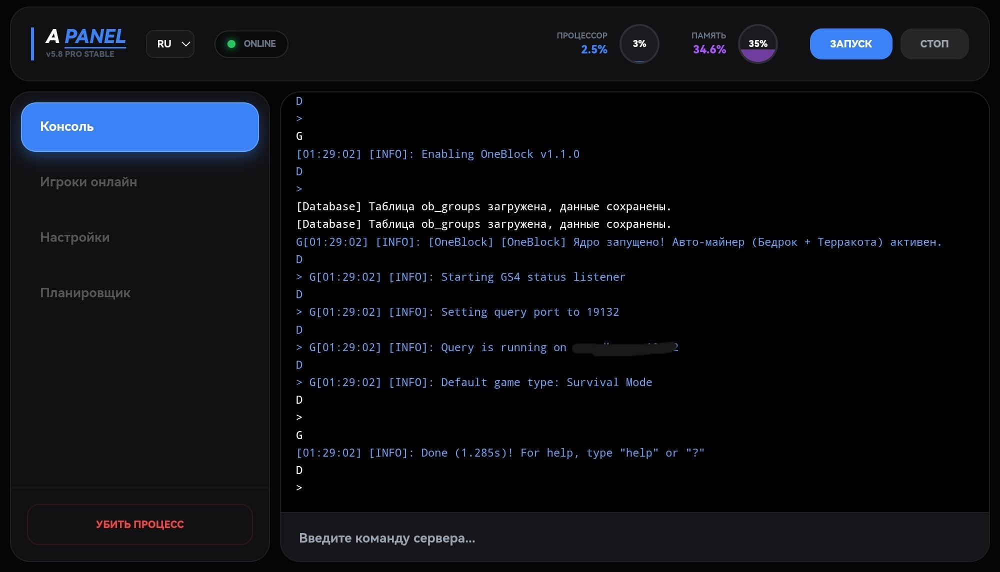

    
    ##A-PANEL v5.8 PRO STABLE 🚀##

A-PANEL — это современная, высокопроизводительная и интуитивно понятная панель управления игровыми серверами. Разработана для обеспечения максимальной стабильности и удобства администрирования в реальном времени.

✨ Основные преимущества

#Live Console: Мгновенный отклик и выполнение команд сервера без задержек.#
#Реал-тайм Мониторинг: Наглядное отслеживание нагрузки на CPU и потребления RAM с помощью анимированных индикаторов.#
#Умный Планировщик: Автоматизация задач и событий сервера в несколько кликов.#
#Стабильность PRO-уровня: Оптимизированное ядро (v5.8), обеспечивающее бесперебойную работу 24/7.#
#Dark Mode UI: Современный минималистичный интерфейс, снижающий нагрузку на глаза при длительной работе.#

🛠 Технический стек

#Backend: Высокоэффективная обработка запросов для связи с игровыми ядрами.#
#Frontend: Адаптивный интерфейс с поддержкой мобильных устройств и десктопов.#

🚀 Быстрый старт

#Склонируйте репозиторий: git clone https://github.com#
#Настройте конфигурацию в разделе Настройки.#
#Нажмите кнопку ЗАПУСК в верхней панели управления.#

📈 Статус проекта

На данный момент панель находится в статусе STABLE. Мы постоянно работаем над улучшением функционала и безопасности.
